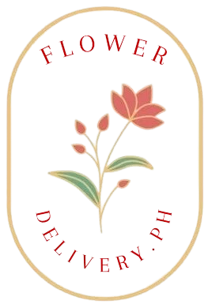

<a name="readme-top">

<br/>

<br />
<div align="center">
  <a href="https://github.com/zyx-0314/">
  <!-- TODO: If you want to add logo or banner you can add it here -->
    
  </a>
<!-- TODO: Change Title to the name of the title of your Project -->
  <h3 align="center">Flower Delivery.Ph</h3>
</div>
<!-- TODO: Make a short description -->
<div align="center">
  Floral Shop Website
</div>

<br />

<!-- TODO: Change the zyx-0314 into your github username  -->
<!-- TODO: Change the WD-Template-Project into the same name of your folder -->


[]([https://wakatime.com/badge/user/018dd99a-4985-4f98-8216-6ca6fe2ce0f8/project/63501637-9a31-42f0-960d-4d0ab47977f8](https://wakatime.com/@09d4efe9-222d-4c0d-a5d1-999f614e91ef/projects/cgbzmbblhh?start=2024-11-22&end=2024-11-28))

---

<br />
<br />

<!-- TODO: If you want to add more layers for your readme -->
<details>
  <summary>Table of Contents</summary>
  <ol>
    <li>
      <a href="#home">Home</a>
      <ol>
        <li>
          <a href="#about">About</a>
        </li>
        <li>
          <a href="#products">Products</a>
        </li>
      </ol>
    </li>
    <li>
      <a href="#Contacts">Contacts</a>
    </li>
    <li>
        <a href="#form">Form</a>
    </li>
  </ol>
</details>

---

## Overview
Flower Delivery.PH is a project designed to serve as an online platform for users to conveniently order and arrange the delivery of fresh flowers. This user-friendly website integrates HTML, CSS, and Bootstrap to create a visually appealing and responsive interface that ensures a seamless user experience across various devices.

### Technology
<!-- TODO: List of Technology Used -->


## Rules, Practices and Principles
1. Always use `WD-` in the front of the Title of the Project for the Subject followed by your custom naming.
2. Do not rename any .html files; always use `index.html` as the filename.
3. Place Files in their respective folders.
4. All file naming are in camel case.
   - Camel case is naming format where there is no white space in separation of each words, the first word is in all lower case while the succeding words first letter are in upper followed by lower cased letters.
   - ex.: buttonAnimatedStyle.css
5. Use only `External CSS`.
6. Renaming of Pages folder names are a must, and relates to what it is doing or data it holding.
7. File Structure to follow below.

```
WD-ProjectName
└─ assets
|   └─ css
|   |   └─ style.css
|   └─ img
|   |   └─ fileWith.jpeg/.jpg/.webp/.png
|   └─ js
|       └─ script.js
└─ pages
|  └─ pageName
|     └─ assets
|     |  └─ css
|     |  |  └─ style.css
|     |  └─ img
|     |  |  └─ fileWith.jpeg/.jpg/.webp/.png
|     |  └─ js
|     |     └─ script.js
|     └─ index.html
└─ index.html
└─ readme.md
```

## Resources

<!-- TODO: Add References -->
| Title | Purpose | Link |
|-|-|-|
| Bootstrap Hero Section | Used for product | (https://mdbootstrap.com/docs/standard/extended/hero/) |
| Responsive Flower Website | Mainly used as a reference guide, to provide a plan of structure of my website | https://youtu.be/4n3TBgeld9s?si=axevuwyyVaOUOC_R |
| Flower Delivery.PH | Main Website used for refrences | (https://www.flowerdelivery.ph/) |
| Item Shop Template | Used for every product landing pages |(https://startbootstrap.com/template/shop-item) |
| Bootstrap Middle Button | Used in the about me section with revised modifications |(https://startbootstrap.com/template/shop-item) |
| Footer | Revised code for footer with added image logo |(https://startbootstrap.com/template/shop-item) |
| Bootstrap About Us landing page | Used for about us landing page |(https://bootstrapbrain.com/component/bootstrap-about-us-page-section/#code) |
| Bootstrap Forms Page | Used and revised code for checkout form |(https://mdbootstrap.com/snippets/standard/mdbootstrap/4809952) |
